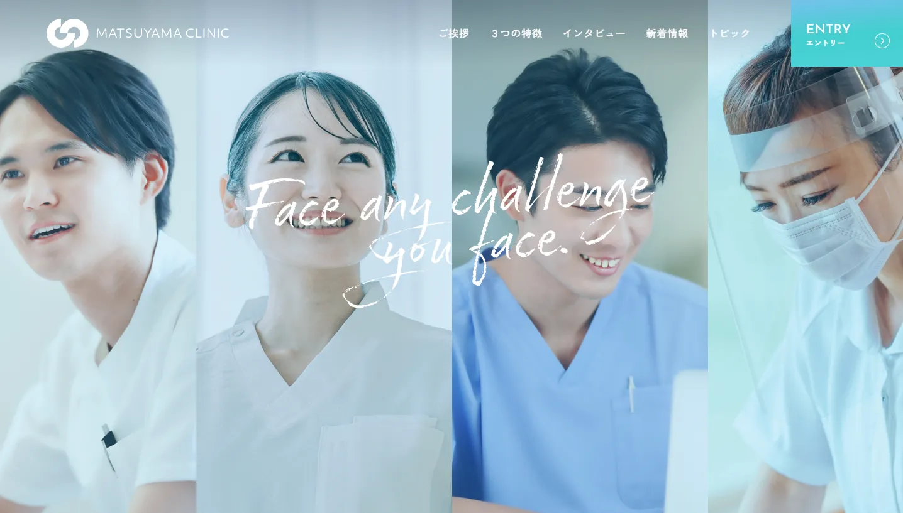

# 🧩 Matsuyama Clinic – Web Coding Demo（架空サイト）



## 🔗 Demo

（仮想 URL）
[https://omi758.github.io/matsuyama-clinic-demo/](https://omi758.github.io/matsuyama-clinic-demo/)

## 📝 Overview（概要）

HelloMentor 課題で制作した医療系クリニックの架空リクルーティングサイト（静的コーディング）です

- リキッドレイアウトを採用

- BEM に基づく CSS 設計で保守性の高いコーディング

- GSAP を使用したハンバーガーメニューのモーダルアニメーション

- レスポンシブ対応（SP / PC）

- UI/UX を意識したアニメーション・ボタンデザイン

- 実務を想定して「読みやすさ・保守性・再利用性」を重視した構成

## 🛠️ Tech Stack（使用技術）


## ✨ Features（制作ポイント）

### 1. ハンバーガーメニューを GSAP でアニメーション

- モーダルのフェードイン・フェードアウト
- ユーザー操作に応じた閉じ処理（クリック・リンク選択・エスケープキー押下等）

### 2. BEM ベースの CSS 設計 と 保守性の高い ES Modules を採用した構成

- 読みやすい class 命名と SCSS のファイル分割と構造化
- 保守性の高い ES Modules を採用し、干渉を最小限に抑えた構成

### 3. レスポンシブ対応

- SP / PC のレスポンシブ対応、余白とタイポグラフィの調整

### 4. CSS アニメーションを使用した UI 効果

- ホバー時のボタンアニメーション

## 📂 Directory（主な構成）

```text
.
└── index.html
    ├── css
    │   └── style.css
    │   └── style.css.map
    ├── img
    ├── js
    │   └── main.js
    │   └── component
    │   │   └── hamburgermenu.js
    │   │   └── smoothscroll.js
    │   └── utility
    │       └── viewport.js
    └── scss
        ├── component
        ├── foundation
        ├── global
        ├── layout
        ├── page
        ├── utility
        └── style.scss
```
